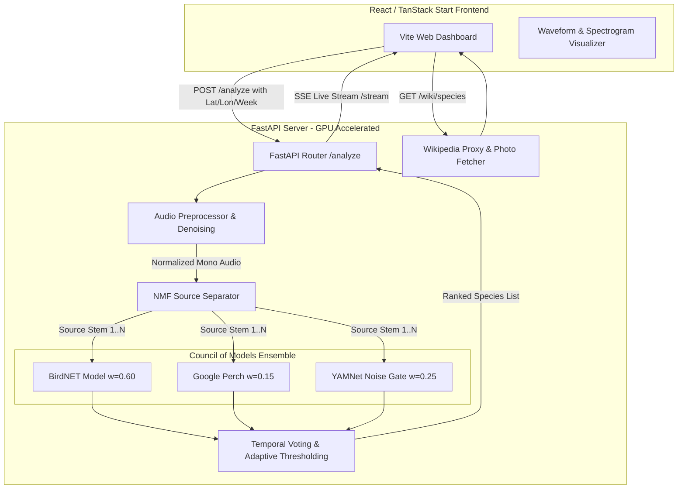

# <p align="center">🐦 BirdSense AI — Bioacoustic Species Detector</p>

<p align="center">
  
  
  
  
  
  
  
</p>

---

## 🌟 Overview

**BirdSense AI** is a state-of-the-art, full-stack bioacoustic species detection system. It is designed to solve a major limitation of standard audio classifiers: **identifying overlapping bird calls in noisy, complex forest recordings**. 

Unlike standard systems that analyze only a single audio channel and pick the loudest sound, BirdSense separates the audio into distinct signals using **Non-negative Matrix Factorization (NMF)**, then feeds the separated signals to a **Council of Models Ensemble** running on high-performance cloud GPUs.



---

## 🧠 Core Features

### 1. The "Council of Models" Ensemble
To achieve industry-leading accuracy, BirdSense leverages a weighted ensemble combination of three neural networks:
*   **BirdNET (Lead Classifier - 60% Weight):** Developed by Cornell Lab, specializing in recognizing 6,000+ bird species. Takes advantage of location (lat/lon) and temporal (week of year) priors to filter candidates.
*   **YAMNet (Audio Gatekeeper - 25% Weight):** Google's general-purpose acoustic classifier. Evaluates the signal quality and functions as an active noise gate. It penalizes non-bird sounds (such as engine noise, speech, and wind) to prevent false positives.
*   **Google Perch (Peer Reviewer - 15% Weight):** Google's specialized bird vocalization model from TensorFlow Hub. It cross-checks BirdNET predictions using a distinct neural embedding workspace.

### 2. NMF Source Separation
Incoming audio is automatically split into multiple spectral stems (default: 2–4).
*   **Isolates calls:** Separates overlapping bird vocalizations into distinct clean audio tracks.
*   **Combats noise:** Isolates steady background wind/rain from short transient bird calls.
*   **Enables deep inspection:** The model ensemble analyzes the original clip *plus* each individual separated source, voting on the combined results.

### 3. Adaptive Thresholding
Rather than using static confidence filters that miss quiet bird calls or report static noise, BirdSense dynamically calculates a standard-deviation threshold based on the signal-to-noise profile of each individual recording:
$$\text{Threshold} = \max\left(0.10, \min\left(\mu_{\text{conf}} + 0.2\sigma_{\text{conf}}, 0.35\right)\right)$$
This enables high sensitivity in clean recordings and filters out chatter in noisy environments.

---

## ⚡ Tech Stack

*   **Backend:** Python 3.10, FastAPI, Uvicorn, TensorFlow, Librosa, Scikit-learn (NMF), BirdNET-Lib, Noisereduce.
*   **Frontend:** React 19, TypeScript, TanStack Start (Full-stack SSR framework built on TanStack Router & Nitro), Tailwind CSS v4, Framer Motion, GSAP, Three.js (dynamic background animations).
*   **Containerization & Deployment:** Docker, Hugging Face Spaces (CPU/GPU), Modal.com (Serverless GPU), Vercel (Frontend SSR hosting).

---

## 📁 Repository Structure

```
.
├── backend/
│   └── api.py                    # FastAPI server exposing endpoints and SSE streams
├── preprocess/
│   ├── audio_processor.py        # Denoising, resampling (32kHz/16kHz), normalization
│   ├── audio_separator.py        # NMF source separation algorithm
│   ├── dataset_builder.py        # Orchestrates the folder layouts for inference
│   └── config.py                 # FFT, sample rate, and path configurations
├── utils/
│   └── file_utils.py             # Safe directory creations & system file cleaners
├── src/
│   ├── components/
│   │   ├── birdsense/            # Dashboard widgets (Upload, Progress tracker, Audio visualizer)
│   │   └── ui/                   # Styled Radix primitives
│   ├── routes/
│   │   ├── index.tsx             # Dynamic landing page showcasing signature profiles
│   │   ├── app.tsx               # Primary dashboard interface
│   │   └── about.tsx             # Deep technical overview
│   └── styles.css                # Custom visual theme and glassmorphism styling
├── main.py                       # Pipeline runner connecting preprocessing and inference
├── eval_prebuilt.py              # Core ML engine (BirdNET + YAMNet + Perch scoring)
├── modal_app.py                  # Modal serverless GPU backend configuration
├── Dockerfile                    # Containerization for Hugging Face Spaces deployment
├── requirements_colab.txt        # Full ML stack dependencies (Google Colab/Modal/Docker)
└── requirements_local.txt        # Legacy UI dependencies (for Streamlit fallback)
```

---

## 🚀 Deployment & How to Run

BirdSense splits local React execution from heavy GPU AI operations.

### Option A: Deploy Backend to Modal.com (Recommended)
Deploying to [Modal](https://modal.com) gives you a permanent, highly scalable serverless T4 GPU backend that is **100% free** under Modal's $30 monthly credit.

1.  **Install the CLI:**
    ```powershell
    pip install modal
    ```
2.  **Authenticate:**
    ```powershell
    modal token new
    ```
3.  **Deploy:**
    ```powershell
    modal deploy modal_app.py
    ```
    > [!TIP]
    > If you encounter PowerShell encoding warnings on Windows, run the deployment with:
    > `$env:PYTHONIOENCODING="utf-8"; modal deploy modal_app.py`

This will output a permanent URL like `https://[YOUR_USERNAME]--birdsense-api.modal.run`. Paste this URL directly into the frontend connection panel!

---

### Option B: Deploy Backend to Google Colab GPU (Alternative)
If you prefer not to create a Modal account, you can run the backend interactively on a free Google Colab GPU session using the provided notebook.

1.  Upload `orch.ipynb` to your **Google Drive**.
2.  Open it in Google Colab and set your runtime to GPU: `Runtime -> Change runtime type -> T4 GPU`.
3.  Run all cells under **Section 1 (Setup)** and **Section 3 (Server)**.
4.  Copy the generated Tunnel URL (localtunnel or ngrok link) printed in Cell 3.4 and paste it into the frontend.

---

### Option C: Run / Deploy Frontend (React app)
The frontend uses TanStack Start, which builds a highly optimized web application utilizing the serverless Nitro engine.

#### 1. Running Locally
Make sure you have [Node.js](https://nodejs.org/) installed, then run:
```bash
npm install
npm run dev
```
Open **`http://localhost:3000`** in your browser.

#### 2. Deploying to Vercel
1.  Push your code to **GitHub**.
2.  Go to the [Vercel Dashboard](https://vercel.com) and import your repository.
3.  Vercel automatically detects the Vite configuration and SSR output directory (`.vercel/output`).
4.  Add your optional backend URL as an environment variable `VITE_BACKEND_URL` under project settings.
5.  Click **Deploy**.

---

## 🛠️ API Reference

The backend API automatically documents itself at `/docs` (Swagger UI) or `/redoc` when running.

| Method | Endpoint | Description |
| :--- | :--- | :--- |
| `GET` | `/health` | Returns the health status, loaded models status, and GPU hardware info. |
| `POST` | `/analyze` | Submits audio file. Accepts Form Data: `file`, `n_sources`, `lat`, `lon`, `week`. Returns `run_id`. |
| `GET` | `/stream/{run_id}` | Event Stream (SSE) returning live pipeline progress logs (e.g. separation, ensembling). |
| `GET` | `/results/{run_id}` | Polling endpoint returning final ensembled species detections and Wikipedia links. |
| `GET` | `/wiki/{species}` | Proxy to Wikipedia API with in-memory caching to avoid CORS blocks. |

---

## 🐛 Troubleshooting

| Symptom | Probable Cause | Fix |
| :--- | :--- | :--- |
| **`Cannot reach Colab/Backend`** | Server is sleeping or tunnel has expired. | Verify the URL is correct. If using Colab, restart the server cells. If using Modal, verify deployment logs. |
| **`models_loaded` shows `False`** | TF Hub models are still downloading in the background. | Wait 2–3 minutes for models to cache on first boot, then query `/health` again. |
| **`GPU devices: CPU only`** | TensorFlow started without GPU bindings or running on a non-GPU host. | In Colab, make sure GPU is active in runtime settings. In Modal, check that `gpu="T4"` is specified in `modal_app.py`. |
| **`File too large` (HTTP 413)** | The uploaded audio file exceeds the 50 MB limits. | Compress or truncate the audio file to under 50 MB before uploading. |

---

## 📄 License & Attribution
*   **BirdNET Classifier:** Powered by Cornell Lab of Ornithology (licensed under Creative Commons).
*   **Google Perch & YAMNet:** Open-source models distributed via TensorFlow Hub under the Apache 2.0 license.
*   Developed as part of the Bioacoustic Diversity Project. Contact: `reddynikhil2812@gmail.com`
